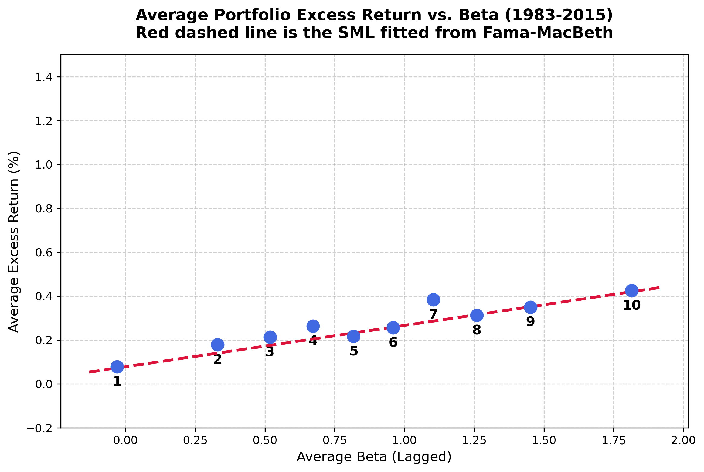

# CAPM-US: Empirical Tests of the CAPM

This is a quantitative finance project utilizing object-oriented Python and panel data analysis. It aims to conduct empirical tests of the classic Capital Asset Pricing Model (CAPM) on the US stock market (1980-2015).

## Methodology

This project fully replicates the standard workflow of modern empirical financial research:

1. **Rolling Beta Estimation:** Calculated the CAPM Beta for 982 S&P 500 companies using a 36-month rolling window.
2. **Portfolio Sorting:** Sorted stocks into 10 decile portfolios monthly based on the estimated Beta values.
3. **Time-Series CAPM Tests:** Conducted OLS regressions on portfolio excess returns, utilizing Newey-West (lag=4) adjusted standard errors.
   [ Return_p = Alpha + Beta * Market_Return + Error ]
4. **GRS Test:** Calculated the Gibbons-Ross-Shanken statistic to jointly test the null hypothesis that all pricing errors (Alpha) are equal to zero.
5. **Fama-MacBeth Cross-Sectional Regression:** Performed a two-pass cross-sectional regression to estimate the risk premium and evaluate the validity of the unconditional CAPM.
   [ Return_p = Gamma_0 + Gamma_1 * Lagged_Beta + Error ]
6. **Sub-Sample Stability:** Split the sample into Era I (1983-1999) and Era II (2000-2015) to examine the time-varying nature and stability of the CAPM parameters.

## Key Findings

1. **Abnormal Returns Exist:** The GRS test result is highly significant (P-value approaches 0), strongly rejecting the null hypothesis of joint Alpha = 0. This indicates that the market Beta alone cannot fully explain the cross-sectional variation in portfolio excess returns.
2. **Flat Security Market Line (SML):** The Fama-MacBeth test reveals that the risk premium parameter (Gamma_1) is statistically insignificant. Investors assuming higher systematic risk (high Beta) did not earn adequately higher expected returns, implying the failure of the unconditional CAPM.
3. **Model Instability:** The sub-sample stability test demonstrates that the unconditional parameters of the CAPM experience severe fluctuations and lack robustness across different historical periods.

**SML Fitted Line Visualization:**



## How to Run

```bash
# 1. Clone the repository

git clone https://github.com/2002dangquan/Asset-Pricing.git/Empirical-Failure-of-CAPM.git
cd Asset-Pricing/Empirical-Failure-of-CAPM

# 2. Install dependencies
pip install -r requirements.txt

# 3. Execute the code
Open `src/Empirical-Failure-of-CAPM.ipynb` using Jupyter Notebook or Jupyter Lab, and run all cells to reproduce the empirical results and visualizations.
```
